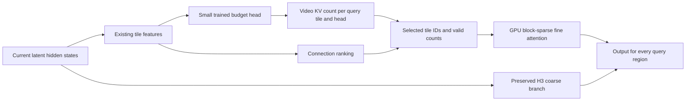

# Adaptive region attention: research for FastH3

**Naming and scope correction (2026-10-02):** The user's latest clarification
concerns recent pretrained **Bev decision models**. The bird's-eye-view token
halting literature below was an earlier interpretation, not an identification of
the intended project. Evaluate the named model and its input/latency contract
before adopting the custom-controller plan.

Two identified projects are
[avbiswas/bev-decider-0.4B](https://huggingface.co/avbiswas/bev-decider-0.4B) and
[Reza2kn/Bev](https://huggingface.co/Reza2kn/Bev); the exact intended release is
awaiting clarification. The smaller decider supplies pretrained Qwen-derived
weights and a trained decision head, returning choices/yes-no/ordinal scores from
text or JSON in one forward pass. Its card lists approximately 0.97 GB of weights
and a non-commercial weights license; it does not establish visual-region
attention quality or latency on the generator GPU. The Bonsai-based Bev engine
uses a 27B ternary model and documents text-based finite-choice scoring.

For this direction the first experiment is reuse of released weights, with a
meaningful structured state and measured complete decision cost. Input preparation,
tokenization, transfers and competition with the generator count toward that
cost. Neither release provides an inspected native image/video-latent input path
or a ready-made per-region H3 attention policy. A zero-shot policy experiment
needs regional facts the model can understand; arbitrary latent-vector numbers
are not an established input bridge. Model or paper weights were not downloaded.

### Evidence for fast variable attention budgets

[LoSA's direct equal-coverage experiment](https://arxiv.org/html/2608.12032)
compares fixed-ratio Top-K with per-head/per-query retained-mass budgets on
Wan2.1-1.3B. At the same 66.1% average attention coverage, both measure 1.37×
speedup over dense attention; retained attention mass increases from 96.5% to
99.0%, and worst-layer recall from 86.6% to 97.3%. Those recall values describe
attention-map fidelity, not final-video quality. In a separate end-to-end
comparison LoSA reports 1.36× dense speed and a −0.06 VBench Overall delta.

[SVG2 v5](https://arxiv.org/html/2505.18875v5), sections 4.1–4.3 and 5, is a
training-free implementation of variable attention budgets. It clusters current
Q/K activations, estimates cluster attention mass, and selects enough KV clusters
to reach a top-p target. Centroid reuse and variable-block kernels control costs.
The authors report up to 2.30× HunyuanVideo and 1.89× Wan2.1 speedup on H100.
[Public code](https://github.com/svg-project/Sparse-VideoGen) supports Wan and
Hunyuan inference; MiniMax H3 compatibility is unverified here.

[LoSA](https://arxiv.org/html/2608.12032), method and table 1, chooses a different
KV budget for each head/query block to retain 99% of attention mass, then reuses
the mask. The authors report Wan1.3B times of 104s dense, 62s SVG2 and 77s LoSA,
with VBench Overall drops of 0.45 and 0.06 points respectively. Its default uses
dense steps 0–3 before sparse reuse, leaving no reuse step in a four-step run.
Its baseline is dense; these gains do not establish improvement over sparse B1.

These results support adaptive-attention feasibility. They do not establish
that pretrained text-based Bev can improve the policy, or that either method
ports to this node's gate/prefix/precision/sampling contract without evaluation.

Reviewed online on **2026-10-02**. Status: research and proposed experiments; no
adaptive region-budget implementation or FastH3 performance result is established
by this document. Sources are linked; full papers are not stored in the node.

The target is the **MiniMax H3 generator** in this directory. The separate
LTX-based SoL refiner/upscaler is outside this proposal. The objective is a small
controller, resident in the generator's GPU process, that allocates different
attention budgets across the video latent grid without consuming the time it
saves.

## What the papers establish

The closest direct predictor precedent is **DSV**. **VSA** is the most relevant
starting point for this node's existing tile routing. The BEV token-halting paper
is a plausible match for the remembered BEV implementation, but that identity is
unconfirmed. These are different mechanisms:

| Work | Controlled work | Relevance to this proposal |
| --- | --- | --- |
| [DSV](https://arxiv.org/abs/2502.07590v3) | Predicted query/key connections; sparsity configured per head | Small attention predictors; per-query sparsity levels remain future work |
| [VSA](https://arxiv.org/abs/2505.13389v5) | Selected key/value cubes for each query cube and head | Dynamic connections with a fixed Top-K budget |
| [BEV token halting](https://arxiv.org/abs/2303.05078v2) | Whether spatial tokens continue into later layers | Learned spatial compute scores and reuse of halted features |
| [DyDiT](https://arxiv.org/abs/2410.03456v2) | Spatial MLP bypass; timestep-based width | Separate example of learned compute allocation |
| [RegenHance](https://arxiv.org/abs/2407.16990v6) | Macroblocks selected for enhancement before analytics | Small region-importance classifier; different objective |

The variable **amount** of attention per query region proposed here is an
extension to this node. Its existing content-dependent choice of connections
does not establish variable region budgets.

The follow-up [implementation plan](ADAPTIVE_ATTENTION_PLAN.md) defines the
initial controller comparison and bounded feasibility gates. It starts with
5%, 10% and 20% video retention against the current 20% B1 teacher, with a
75-parameter linear head and a 899-parameter MLP alternative. These are proposed
architectures requiring training, not available trained controller weights.

### DSV: a small predictor inside video diffusion

Read: [full text, v3](https://arxiv.org/html/2502.07590v3), sections 3, 5–6,
9.2–9.3, 10 and appendix B. Implementation reference:
[authors' ASPLOS artifact](https://zenodo.org/records/16778687). The artifact's
listing was checked; its code has not been executed or qualified for this node.

DSV adds two trained low-rank input projections per attention module, with
default inner dimension 16. Their product approximates the original query/key
scores. Predictors initially train against sampled scores independently of the
main model; sparse model training follows once prediction is accurate enough.
Dispatch considers prediction overhead, memory, and measured sparse-kernel cost.

Its estimation kernel combines low-rank products and selection without storing
the full token-pair matrix. Nearby queries share selected keys through query
grouping. This is substantially more than attaching a classifier to a mask.

Reported inference gains are 2.0–3.5× over full attention for 40 sampling steps
with CFG: a 2.7B model on one H800, or a 30B model on four H800s. These are not
FastH3 measurements. Section 10 explicitly uses uniform sparsity across queries
within each head and leaves query-specific budgets for future work. Lower rank
reduces scoring arithmetic, but scoring all token pairs still scales
quadratically unless further structure is introduced.

### VSA: routing and global context are separate operations

Read: [full text, v5](https://arxiv.org/html/2505.13389v5), sections 2.2–2.4,
3.1, 3.3–3.5, appendices B, C.5–C.6 and D. Implementation:
[FastVideo](https://github.com/hao-ai-lab/FastVideo).

VSA pools query, key and value tokens into 4×4×4 cubes. Coarse query/key scores
select Top-K key/value cubes per query cube/head. Fine attention processes the
selected 64-token cubes. Coarse global output also contributes through learned
gates. The gate blends outputs; it is not a standalone region-budget classifier.

The coarse stage is under 0.2% of attention FLOPs but about 14% of attention
runtime at the reported 87.5% sparsity. Selection dominates its overhead, and
smaller tiles can lose throughput despite better selectivity. Mean pooling won
over the tested convolutional and max-pooling alternatives.

The reported Wan-1.3B comparison reduces DiT inference from 31s to 18s on H100;
this is not this service's MP4-ready latency. Sparse adaptation trains the model
and gates while gradually increasing sparsity. The paper also studies joint
sparse/few-step distillation. Section 3.5 identifies adaptive Top-K as future
optimization. Neither the paper's K=32 nor its sparsity percentage is a universal
setting for H3 checkpoints.

### BEV dynamic token halting: the spatial scorer precedent

Read: [paper and appendices, v2](https://arxiv.org/pdf/2303.05078v2), sections
4.2–4.6, 6.1–6.2 and appendix A.2. Also see the
[ICCV publication page](https://openaccess.thecvf.com/content/ICCV2023/html/Ye_Efficient_Transformer-based_3D_Object_Detection_with_Dynamic_Token_Halting_ICCV_2023_paper.html).
No verified public code repository was identified in the reviewed primary pages.

This LiDAR detector uses a MobileNetV2-based lightweight U-Net for its first
halting module and a one-layer MLP for its second, using 32 token features.
Scores and quantile-based thresholds decide which tokens continue. Halted
features are recycled into the final BEV map instead of discarded.

Training combines detection losses, weighted attention, a differentiable
training surrogate and a foreground-biased sparsity loss derived from boxes.
The reported speed comparison measures the SST backbone on A100, not a video
generator or an isolated scorer. This establishes trained spatial compute
allocation, but neither its detection labels nor its stopping policy establishes
generation fidelity. A small scorer can help; the complete approach does not
consist of a universally interchangeable tiny classification model.

### DyDiT: spatial bypass applies to MLPs

Read: [full text, v2](https://arxiv.org/html/2410.03456v2), sections 3.2–3.4,
4.1 and appendix B.1. Implementation:
[official repository](https://github.com/NUS-HPC-AI-Lab/Dynamic-Diffusion-Transformer).

DyDiT's spatial router decides which tokens bypass each layer's MLP. Attention
continues to establish token interactions. Active tokens are gathered, processed
and scattered back. Its other routers choose attention heads and MLP channel
groups from the timestep; those width decisions can be prepared offline.

Routers train with the generation objective and a FLOPs constraint. The 1.73×
DiT-XL result comes from image generation on V100 with the optimal batch size
for each model. It is not evidence for a 1.73× gain on a four-step video model.
The distinction matters here: a spatial MLP router would affect the fused MLP
path, while a query/key budget router affects attention. They require separate
implementations and measurements.

### RegenHance: classify the benefit of extra work

Read: [full text, v6](https://arxiv.org/html/2407.16990v6), sections 3.2–3.4,
4.1–4.4. The reviewed text describes the implementation; this note does not
claim an inspected, runnable code artifact.

RegenHance labels 16×16 pixel macroblocks with ten importance levels. Training
labels combine downstream analytics sensitivity with the pixel change produced
by enhancement. Its MobileSeg predictor uses MobileNetV2, prunes 50% of its
parameters, and can run through TensorRT or OpenVINO. Predictors are specific to
the downstream task.

It reuses importance maps across selected frames using codec residual changes,
packs selected regions into dense enhancement tensors, and profiles execution
resources. Its reported 2–3× throughput is for the combined video-analytics
system, not attention routing. The useful lesson is to label the **benefit of
extra computation**, rather than generic object presence. Codec-based map reuse
assumes decoded input video; it supplies no ready-made reuse signal for changing
diffusion latents.

## Mapping the findings to the checked-out node

These are observations of the current source, not execution or equivalence
claims about installed GPU kernels.

| Source | Existing responsibility | Implication for adaptive budgets |
| --- | --- | --- |
| [sol_attn_minimax_v5.py](sol_attn_minimax_v5.py), `_vsa_plan` | 4×4×4 video cubes, padded edges, prefix tiles, inverse permutation | Keep the coordinate mapping; a flattened region index must survive retiling |
| Same file, `_make_producer_forward` | Chunked QKV, checkpoint gate projection, CUDA producer, `run_vsa_chunked` | A controller belongs in this GPU path, using features already available there |
| [vsa_sm120/producer.py](vsa_sm120/producer.py), `project_chunks` | Measurement and emission traversals; gate/QKV projection | Account for every controller evaluation; bootstrap traversal must not silently duplicate it |
| [vsa_sm120/reference.py](vsa_sm120/reference.py), `route_blocks` | Pooled query/key ranking; fixed video Top-K; exact prefix selection | Defines selection semantics; its Python implementation is a reference, not the production performance path |
| Same file, `sparse_attn` | Fine output plus a separate gated coarse contribution | Preserve the trained H3 coarse branch when experimenting with budgets |
| [vsa_sm120/layout.py](vsa_sm120/layout.py), `n_video_keep` | One scalar count from `ceil(video_blocks * topk_ratio)` | Does not currently describe a different count for each query cube |
| [vsa_sm120/dispatch.py](vsa_sm120/dispatch.py), `run_vsa_chunked` | Passes scalar `topk_ratio` into the Kitchen production call | A per-region count requires an explicit supported kernel contract |
| [loader.py](loader.py), `GatedH3Model` | Loads `to_gate_compress` as a full-width projection from checkpoint weights | This existing gate is not a new scalar budget predictor and cannot be repurposed without changing model semantics |
| [runtime.py](runtime.py), [kitchen_baseline.py](kitchen_baseline.py) | Preset/checkpoint identity, steps, keep fraction and B1 policy | Compare against the resolved preset and actual execution report |

Two distinctions correct the earlier discussion. First, H3's trained coarse
gate and the proposed region-budget head are different components: local
`route_blocks` ranks using pooled Q/K, while `sparse_attn` handles its coarse
contribution separately. The H3 reference's coarse calculation is also not
automatically identical to the generic Wan formula in the VSA paper. Second,
dynamic **connections** are already present; dynamic **counts per query region**
are the proposed addition.

The checked-out B1 default resolves to the V2 checkpoint, four sampling steps,
20% video retention, 64-token cubes and Kitchen 0.2.34. The generic
`VsaOptions.topk_ratio=0.10` is not that resolved preset. B1 policy metadata says
`promotion_status="awaiting_gpu_evidence"`; a configuration hash or a `safe`
configuration label is not a performance or quality qualification. Re-read the
resolved manifest before designing an experiment because these files can change.

`block_len` records valid tokens in an edge/prefix block. It is not a
per-query attention budget. Giving that parameter a different meaning would
break padding and conditioning semantics.

## Proposed controller and attention contract

The following is our synthesis for a future experiment, not an implementation
described or validated by any one paper.



Use a small number of attention-budget classes. The initial plan tests 5%, 10%
and 20% video retention against the current 20% B1 teacher. A separate experiment
could test 10%, 20% and 40%, but it needs a qualified higher-budget teacher or
task-level utility labels: the smallest budget reproducing a 20% teacher cannot
yield a 40% label, because 20% already reproduces that teacher. The predictor
emits a budget for each query cube/head; existing relationship scores rank the
KV cubes within it. Shared controller weights can serve different heads while
their output budgets differ. None of these settings is a trained product policy.

Use pooled hidden states or pooled Q/K already available in GPU memory. A
minimal candidate is a linear or small MLP head over a bounded feature vector,
conditioned on layer and noise level. A 32-feature input or a low-rank projection
is an experiment to measure, not a guaranteed optimum. Materializing another
full-width feature volume can cost more memory traffic than its arithmetic
suggests. An image classifier would need a current decoded image, which may
not exist during text-to-video denoising; early latents mostly contain noise.

Predicting a query's need for detail does not determine its usefulness as a key
for other queries. Do not exclude a tile from everyone's KV candidates solely
because its own query budget is low. Scene layout, background, lighting, distant
objects and temporal relationships must remain possible connections. Preserve
all query outputs, the trained coarse contribution, exact conditioning KV and
the existing dense prefix-query behavior. Budget only the video KV selection.

The device representation needs counts such as `keep_count[head, query_cube]`
and selected block IDs with row offsets, or a fixed-capacity buffer with valid
counts. A kernel must actually stop reading/computing unused blocks; padding
every query to the maximum budget can erase the savings. Budget buckets are
another option, provided grouping and extra launches cost less than they save.
The scalar Kitchen call currently exposed by this node is insufficient on its
own. Replacing it requires a versioned ABI, reference semantics and compatible
compiled kernels for the worker GPU.

Keep controller, ranking and counts on the generator's CUDA device and stream.
Avoid `.item()`, host decisions, frame readbacks, network calls, per-tile Python
loops and allocation of a full token-pair matrix in the inference path. Use
bounded reusable workspace and stable tensor capacities where compilation or
graph capture needs them. Residency in the same process is necessary but does
not by itself make a controller cheap.

## Teaching the controller what deserves work

First establish whether variable budgets help before training a new head. On
offline captured B1 activations, vary the video budget for sampled query tiles
while retaining the H3 coarse/conditioning paths. Measure output error and
whole-video effects. A frozen B1 run is the operational teacher; a separately
validated higher-budget run can provide an additional quality reference. Plain
dense attention must not silently replace this VSA-trained model's teacher.

Label the smallest budget that meets a chosen error tolerance. Train the head
to predict that budget from cheap features, with a measured compute penalty.
Collect cases across prompts, seeds, layers, noise levels, resolutions and
video lengths. Include camera motion, scene cuts, small moving subjects,
occlusion, hands, text and synchronized speech. Calibrate uncertainty so that
poorly supported cases retain the established B1 budget or a validated higher
budget. Reuse across layers/steps is a separate approximation experiment:
coordinate identity does not prove feature or attention-pattern stability.

This is a proposed adaptation procedure. Predictor-only fitting can establish
classification accuracy on captures but does not establish quality after the
whole model starts using its decisions. If generation degrades, joint adaptation
or distillation may be required. Neither detection-trained weights nor the
checkpoint's existing compression gates provide this new budget policy.

## Proving that the controller pays for itself

The performance reference is the **existing sparse B1 generator**, not a new
dense comparison. Let `T_changed` include controller, ranking, index construction,
gather/retiling, fine attention, coarse output and merge work affected by the
experiment. Require both:

```text
T_changed(candidate) < T_changed(B1)
T_complete_warm_node(candidate) < T_complete_warm_node(B1)
```

Keep unchanged QKV/MLP, VAE, audio and export costs in the complete-node timing.
A more efficient attention operation cannot reduce those costs automatically.
State cold load/compile separately from warmed inference. Add controller
microseconds over every invocation: a small cost repeated across 50 H3 layers
and four evaluations can still matter. A controller target of at most 1% of
measured generator time is a proposed engineering budget, not a paper result.

For equal-size video cubes, an illustrative allocation of 10% keep to 80% of
queries and 60% keep to 20% of queries averages 20% keep. That redistributes fine
attention work without reducing its theoretical count. Changing the high budget
to 40% gives 16% average keep, about 20% fewer fine video tile interactions than
20% uniform keep. It does not imply 20% faster generation. Prefix work, partial
tiles, load imbalance, kernel occupancy and controller overhead remain.

Before a future runtime change is promoted:

1. Validate the candidate ABI/reference with padding, coordinate restoration,
   prefix KV/query rules, coarse gates and valid counts. Verify that lower
   counts actually skip kernel work.
2. Time scoring, prediction, selection, indices, gathering, fine attention,
   coarse/merge and complete warm node calls on the actual worker GPU. Use
   diagnostic CUDA events/NVTX; synchronize outside the production hot path.
3. Hold request, checkpoint, precision, sampler, resolution, frames, audio,
   power/clock conditions and software identity fixed against B1. Report
   medians, tail latency, spread, peak memory and per-region budget counts.
4. Compare temporal detail, motion, prompt adherence and audio/video alignment
   across the test set. Intentional budget changes need quality evidence rather
   than an assumption of bitwise equivalence.
5. Give the experiment a distinct policy/profile identity. Retain the current
   scalar path as the control; stop using a candidate that fails the measured
   cost or quality allowance.

## Decision recorded from this review

The first practical experiment should measure adaptive budgets using the node's
existing pooled features and tile layout. Add a trained predictor only if an
offline study shows a better cost/quality tradeoff than uniform B1 routing.
DSV offers a more elaborate learned connection predictor if existing rankings
prove inadequate. BEV token halting and DyDiT suggest separate depth/MLP
experiments, which would change a different part of generation.

Remaining unknowns are the remembered BEV implementation's identity, the best
FastH3 training labels, whether per-region budgets beat current sparse routing,
and the cost of a compatible variable-budget GPU kernel. The papers support
the direction; the performance and fidelity of this node still require measured
evidence.

## Follow-up sources considered during planning

[DynamicRad v1](https://arxiv.org/html/2604.20470v1), section 3.4, uses a two-layer
MLP on existing prompt embeddings to choose a global motion/sparsity regime.
It reports a single router pass below 2 ms per video. This is a useful precedent
for a small learned router, but its once-per-video cost does not establish the
cost or quality of a controller evaluated for every latent region and attention
invocation. Its global regime is also different from the evolving region grid
requested here. [Implementation](https://github.com/Adamlong3/DynamicRad).

[HEART v2](https://arxiv.org/html/2605.14513v2), sections 3.2 and 4.1–4.2,
distinguishes local attention-output error from the effect on denoising velocity.
It calibrates head-specific thresholds and uses pooled query/key drift for mask
reuse. This reinforces the need for full-transformer replay and closed-loop
video checks; individually small local errors can interact. Mask reuse is a
separate experiment, particularly with only four generation evaluations.

[AdaSpa](https://arxiv.org/html/2502.21079), section 4, begins with full attention
and online mask search, then reuses masks and cached LSE between selected search
steps. Whether those upfront costs amortize on this four-step generator needs
measurement; a long-step result is not evidence that they will.
